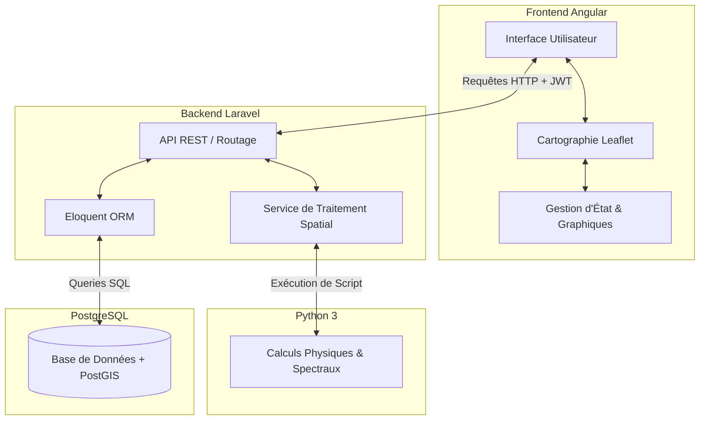
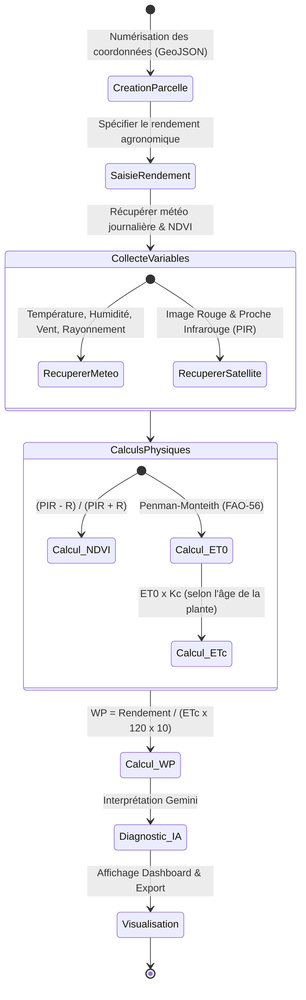
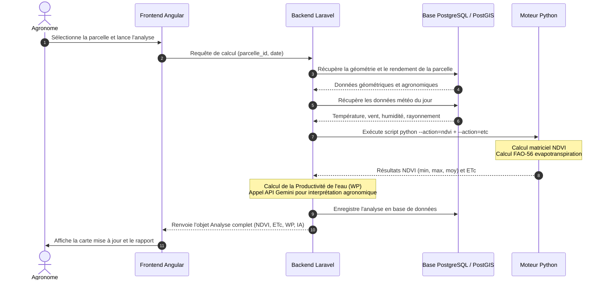
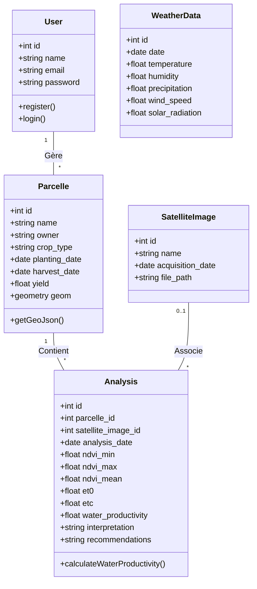

# Cahier des Charges & Documentation Scientifique : GeoVal

GeoVal est une plateforme Web géospatiale et analytique moderne dédiée à la gestion, la surveillance et l'optimisation des parcelles agricoles sur le périmètre irrigué aval du Bagré. Ce document sert de support technique et scientifique complet décrivant la structure, le fonctionnement, les modèles de calcul et la base de données du système.

---

## 1. Présentation de GeoVal

Le périmètre irrigué aval de Bagré (Burkina Faso) constitue une zone stratégique pour la production agricole nationale (riziculture, cultures maraîchères, maïs). L'intensification agricole et le changement climatique imposent une gestion rationnelle et durable des ressources en eau d'irrigation. 

La plateforme **GeoVal** a été conçue pour répondre à cette problématique en fournissant aux gestionnaires de périmètres, aux agronomes et aux coopératives agricoles un outil moderne d'aide à la décision. L'objectif principal de GeoVal est d'évaluer, de cartographier et d'optimiser la **productivité de l'eau ($WP$)** à l'échelle de chaque parcelle en s'appuyant sur l'imagerie satellite et les données météorologiques locales.

---

## 2. Architecture Générale de la Plateforme

### 2.1. Architecture Logicielle
La plateforme repose sur un modèle **Client-Serveur découplé** :
*   **Le Client (Frontend)** : Une application à page unique (Single Page Application) développée en Angular qui gère l'interface utilisateur, la cartographie interactive et la visualisation réactive des graphiques de productivité.
*   **Le Serveur (Backend & Calculs)** : Une API REST développée en Laravel chargée de l'authentification, de la gestion des données métiers et de l'orchestration du moteur d'analyse spatialisé en Python.

### 2.2. Architecture Technique
La plateforme est conteneurisée à l'aide de **Docker** pour garantir une reproductibilité parfaite des environnements de développement et de production.



### 2.3. Choix des Technologies et Justifications
*   **Angular 20** : Choisi pour la rigueur de son typage avec TypeScript et son architecture orientée composants réutilisables. L'utilisation d'**Angular Signals** garantit des performances élevées lors des manipulations de données géographiques réactives.
*   **Leaflet.js** : Préféré à d'autres solutions cartographiques lourdes en raison de sa légèreté, de sa fluidité sur mobile et ordinateur, et de sa gestion native simplifiée des couches vectorielles GeoJSON.
*   **Laravel 11** : Framework PHP de référence, sélectionné pour sa maturité, sa sécurité native (contre les injections SQL et failles CSRF), la simplicité de son ORM Eloquent, et sa gestion transparente des sous-processus système pour lancer les calculs géospatiaux en Python.
*   **Python 3** : Langage incontournable pour le calcul scientifique. Il permet d'exploiter les packages géospatiaux standards comme `rasterio` (lecture de fichiers d'images satellites TIFF), `shapely` (manipulations géométriques) et `numpy` (calculs matriciels rapides).
*   **PostgreSQL 15 & PostGIS** : PostGIS est l'extension spatiale de référence. Elle permet de stocker les coordonnées réelles des parcelles sous forme d'objets géométriques indexés (GIST), optimisant les requêtes géographiques.

---

## 3. Description Complète des Modules

### 3.1. Authentification
Garantit la sécurité d'accès à la plateforme. Les jetons porteurs (JWT/Sanctum) sont stockés localement sur le client pour valider chaque appel à l'API.

### 3.2. Gestion des Utilisateurs
Permet d'affecter des rôles spécifiques (administrateur, agronome conseil, exploitant) afin de limiter l'accès à la modification des parcelles et aux configurations météorologiques.

### 3.3. Gestion des Parcelles
Permet de renseigner les métadonnées agronomiques d'une parcelle :
*   Nom de la parcelle et propriétaire.
*   Type de culture implantée (Riz, Maïs, etc.).
*   Dates clés : plantation/semis, et récolte.
*   Rendement attendu ou historique ($kg/ha$).

### 3.4. Cartographie SIG
Interface de dessin vectoriel permettant de numériser les parcelles à la souris ou d'importer directement un fichier cartographique au format **GeoJSON**.

### 3.5. Analyse NDVI
Module mesurant la vigueur de la végétation. Il extrait l'image satellite de la parcelle, calcule l'indice pixel par pixel et renvoie des statistiques (valeurs minimale, maximale et moyenne de NDVI).

### 3.6. Calcul de l'Évapotranspiration de Référence ($ET_0$)
Estime la demande évaporative de l'atmosphère à partir des paramètres météorologiques du jour (vent, température, humidité, rayonnement).

### 3.7. Calcul de l'Évapotranspiration de la Culture ($ET_c$)
Ajuste l'évapotranspiration de référence en fonction du type de plante cultivée et de son âge (jours après semis), indiquant son besoin en eau réel quotidien.

### 3.8. Productivité de l'Eau
Indicateur phare combinant le rendement déclaré et la somme de l'eau transpirée/évaporée ($ET_c$) sur la saison de croissance.

### 3.9. Tableau de Bord
Visualisation centralisée des performances agronomiques du périmètre (Rendement moyen, NDVI moyen, Productivité globale de l'eau sous forme de graphiques temporels).

### 3.10. IA de Recommandations
Intègre l'API d'intelligence artificielle Gemini pour analyser automatiquement la combinaison NDVI, $ET_c$, Météo et Productivité afin de rédiger des commentaires explicatifs et des conseils agronomiques adaptés pour chaque parcelle.

---

## 4. Description Détaillée de chaque Calcul Scientifique

### 4.1. Indice de Végétation par Différence Normalisée (NDVI)
*   **Formule** :
    $$NDVI = \frac{PIR - Rouge}{PIR + Rouge}$$
*   **Variables** :
    *   $PIR$ : Réflectance dans la bande du Proche Infrarouge (Bande 8 de Sentinel-2).
    *   $Rouge$ : Réflectance dans la bande du Rouge (Bande 4 de Sentinel-2).
*   **Hypothèses** : Les valeurs de pixel utilisées ont été corrigées des effets atmosphériques. Les pixels nuageux sont écartés.
*   **Interprétation** : Les valeurs s'étendent de -1 à 1. Les valeurs positives proches de 0 indiquent un sol nu ou un stress sévère. Les valeurs supérieures à 0.6 décrivent une plante en pleine croissance et vigoureuse.

### 4.2. Évapotranspiration de Référence ($ET_0$)
*   **Formule (Penman-Monteith FAO-56)** :
    $$ET_0 = \frac{0.408 \Delta (R_n - G) + \gamma \frac{900}{T + 273} u_2 (e_s - e_a)}{\Delta + \gamma (1 + 0.34 u_2)}$$
*   **Variables** :
    *   $ET_0$ : Évapotranspiration de référence ($mm/jour$).
    *   $R_n$ : Rayonnement net à la surface de la culture ($MJ/m^2/jour$).
    *   $G$ : Densité de flux de chaleur du sol ($MJ/m^2/jour$, considéré comme nul sur 24 heures).
    *   $T$ : Température moyenne de l'air à 2 mètres de hauteur (°C).
    *   $u_2$ : Vitesse du vent à 2 mètres de hauteur ($m/s$).
    *   $e_s - e_a$ : Déficit de pression de vapeur saturante ($kPa$).
    *   $\Delta$ : Pente de la courbe de pression de vapeur saturante ($kPa/°C$).
    *   $\gamma$ : Constante psychrométrique ($kPa/°C$).
*   **Hypothèses** : Représente une culture de référence de gazon de 12 cm de hauteur uniforme, activement en croissance, ombrageant complètement le sol et bien irriguée.
*   **Interprétation** : Quantifie la perte en eau potentielle générée uniquement par le climat du jour.

### 4.3. Évapotranspiration de la Culture ($ET_c$)
*   **Formule** :
    $$ET_c = K_c \times ET_0$$
*   **Variables** :
    *   $ET_c$ : Évapotranspiration réelle sous conditions optimales ($mm/jour$).
    *   $K_c$ : Coefficient cultural (sans dimension).
    *   $ET_0$ : Évapotranspiration de référence ($mm/jour$).
*   **Hypothèses** : Le coefficient cultural $K_c$ varie de manière dynamique selon trois stades phénologiques : initial (stade précoce), mi-saison (développement maximal), et fin de cycle (maturation/sénescence).
*   **Interprétation** : Quantité exacte d'eau nécessaire à apporter à la plante pour combler ses pertes par évaporation et transpiration.

### 4.4. Productivité de l'Eau ($WP$)
*   **Formule** :
    $$WP = \frac{Rendement \ (kg/ha)}{Consommation \ Saisonnière \ (m^3/ha)}$$
    Où :
    $$Consommation \ Saisonnière \ (m^3/ha) = ET_c \ (mm/jour) \times Durée \ du \ cycle \ (jours) \times 10$$
*   **Variables** :
    *   $WP$ : Productivité physique de l'eau ($kg/m^3$).
    *   $Rendement$ : Masse récoltée par unité de surface ($kg/ha$).
    *   $Durée \ du \ cycle$ : Fixée à 120 jours en standard (durée de croissance du riz irrigué à Bagré).
*   **Hypothèses** : L'évapotranspiration calculée représente fidèlement la consommation en eau saisonnière. 1 mm de hauteur d'eau équivaut à un apport de $10 \ m^3/ha$.
*   **Interprétation** : Plus la valeur de $WP$ est élevée, plus l'exploitation valorise l'eau d'irrigation. Une valeur faible indique une sur-irrigation ou des pertes hydriques importantes pour un faible rendement.

---

## 5. Workflow Complet de l'Application

Le parcours utilisateur et le traitement des données suivent un processus séquentiel précis :

```
[1. Numérisation de la Parcelle]
               │
               ▼
[2. Saisie des Métadonnées (Culture, Rendement)]
               │
               ▼
[3. Collecte des Données Climat & Image Satellite]
               │
               ▼
[4. Traitement Python : Calculs NDVI, ET0 et ETc]
               │
               ▼
[5. Calcul Final de la Productivité de l'Eau (WP)]
               │
               ▼
[6. Interprétation IA (Gemini) & Recommandations]
               │
               ▼
[7. Restitution sur Tableau de Bord & Export PDF/Excel]
```

---

## 6. Diagrammes UML (Mermaid)

### 6.1. Diagramme de Cas d'Utilisation (Use Case)

```mermaid
leftToRightDirection
actor "Agronome / Administrateur" as Admin
actor "Producteur / Exploitant" as User

rectangle GeoVal {
    usecase "Authentification" as UC_Auth
    usecase "Visualiser les parcelles sur la carte" as UC_ViewMap
    usecase "Dessiner et ajouter une parcelle" as UC_AddParcel
    usecase "Calculer le NDVI et l'évapotranspiration" as UC_Analyze
    usecase "Consulter les rapports de productivité" as UC_Reports
    usecase "Générer des recommandations IA" as UC_AI
    usecase "Exporter les données (PDF/Excel)" as UC_Export
}

User --> UC_Auth
User --> UC_ViewMap
User --> UC_Reports

Admin --> UC_Auth
Admin --> UC_ViewMap
Admin --> UC_AddParcel
Admin --> UC_Analyze
Admin --> UC_AI
Admin --> UC_Export

UC_AddParcel ..> UC_Auth : <<include>>
UC_Analyze ..> UC_Auth : <<include>>
```

### 6.2. Diagramme d'Activité



### 6.3. Diagramme de Séquence



### 6.4. Diagramme de Classes



---

## 7. Structure de la Base de Données

Le schéma relationnel ci-dessous détaille les tables clés stockées dans **PostgreSQL / PostGIS** :

### 7.1. Table `users` (Gestion des comptes utilisateurs)
| Colonne | Type | Description |
| :--- | :--- | :--- |
| `id` (PK) | BigInt | Identifiant unique de l'utilisateur |
| `name` | Varchar(255) | Nom de l'utilisateur |
| `email` | Varchar(255) (Unique) | Adresse e-mail de connexion |
| `password` | Varchar(255) | Empreinte sécurisée du mot de passe |
| `created_at` | Timestamp | Date de création du compte |

### 7.2. Table `parcelles` (Données cartographiques et agronomiques)
| Colonne | Type | Description |
| :--- | :--- | :--- |
| `id` (PK) | BigInt | Identifiant unique de la parcelle |
| `name` | Varchar(255) | Nom ou numéro d'identification de la parcelle |
| `owner` | Varchar(255) | Nom du producteur / propriétaire |
| `crop_type` | Varchar(255) | Type de culture (ex: "Riz", "Maïs") |
| `planting_date` | Date | Date de semis / plantation effective |
| `harvest_date` | Date | Date estimée ou réelle de la récolte |
| `yield` | Decimal(10,2) | Rendement historique ou déclaré ($kg/ha$) |
| `geom` | Geometry(Polygon, 4326) | Objet spatial représentant le contour de la parcelle (ou texte brut GeoJSON en fallback) |

### 7.3. Table `weather_data` (Données agro-météorologiques)
| Colonne | Type | Description |
| :--- | :--- | :--- |
| `id` (PK) | BigInt | Identifiant unique de l'enregistrement |
| `date` | Date (Unique) | Date d'observation des paramètres météo |
| `temperature` | Decimal(5,2) | Température moyenne journalière (°C) |
| `humidity` | Decimal(5,2) | Humidité relative moyenne (%) |
| `precipitation` | Decimal(5,2) | Hauteur des précipitations du jour ($mm$) |
| `wind_speed` | Decimal(5,2) | Vitesse moyenne du vent à 2 m ($m/s$) |
| `solar_radiation`| Decimal(8,2) | Rayonnement solaire incident global ($W/m^2$) |

### 7.4. Table `satellite_images` (Métadonnées des acquisitions Sentinel-2)
| Colonne | Type | Description |
| :--- | :--- | :--- |
| `id` (PK) | BigInt | Identifiant de l'image satellite |
| `name` | Varchar(255) | Nom du fichier ou identifiant Sentinel |
| `acquisition_date`| Date | Date de prise de vue par le satellite |
| `file_path` | Varchar(255) | Chemin d'accès physique au fichier TIFF sur le serveur |

### 7.5. Table `analyses` (Résultats des analyses spatiales et agronomiques)
| Colonne | Type | Description |
| :--- | :--- | :--- |
| `id` (PK) | BigInt | Identifiant unique de l'analyse |
| `parcelle_id` (FK) | BigInt | Référence vers la table `parcelles` |
| `satellite_image_id`| BigInt (Nullable)| Référence vers `satellite_images` |
| `analysis_date` | Date | Date de réalisation de l'analyse |
| `ndvi_min` | Decimal(5,4) | Indice NDVI minimal calculé sur la parcelle |
| `ndvi_max` | Decimal(5,4) | Indice NDVI maximal calculé sur la parcelle |
| `ndvi_mean` | Decimal(5,4) | Indice NDVI moyen calculé sur la parcelle |
| `et0` | Decimal(8,4) | Évapotranspiration de référence ($mm/jour$) |
| `etc` | Decimal(8,4) | Évapotranspiration de la culture ($mm/jour$) |
| `water_productivity`| Decimal(10,4) | Productivité physique de l'eau ($kg/m^3$) |
| `interpretation` | Text | Diagnostic rédigé par l'IA Gemini |
| `recommendations` | Text | Recommandations d'irrigation rédigées par l'IA |

---

## 8. Limites de la Solution Proposée

*   En l'absence d'images satellites réelles chargées, l'application s'appuie sur un générateur de données simulées pour le calcul du NDVI.
*   Les calculs géospatiaux lourds sur des fichiers TIFF volumineux sont exécutés en mode synchrone, ce qui peut ralentir le temps de réponse du serveur.
*   Le déploiement des dépendances Python requiert la présence de compilateurs binaires complexes sur le serveur d'hébergement.

---

## 9. Perspectives d'Évolution

*   Mettre en place une connexion automatique avec les API Sentinel-2 pour récupérer les images satellites récentes sans intervention humaine.
*   Intégrer un système d'envoi automatique de notifications par SMS et e-mail pour alerter les producteurs en cas de stress hydrique prononcé.
*   Développer un mode hors-ligne pour permettre aux techniciens de visualiser la carte et de collecter des informations sur le terrain sans connexion internet.
*   Ajouter un module de recommandation de fertilisation azotée basé sur l'évolution temporelle des cartes de NDVI.
